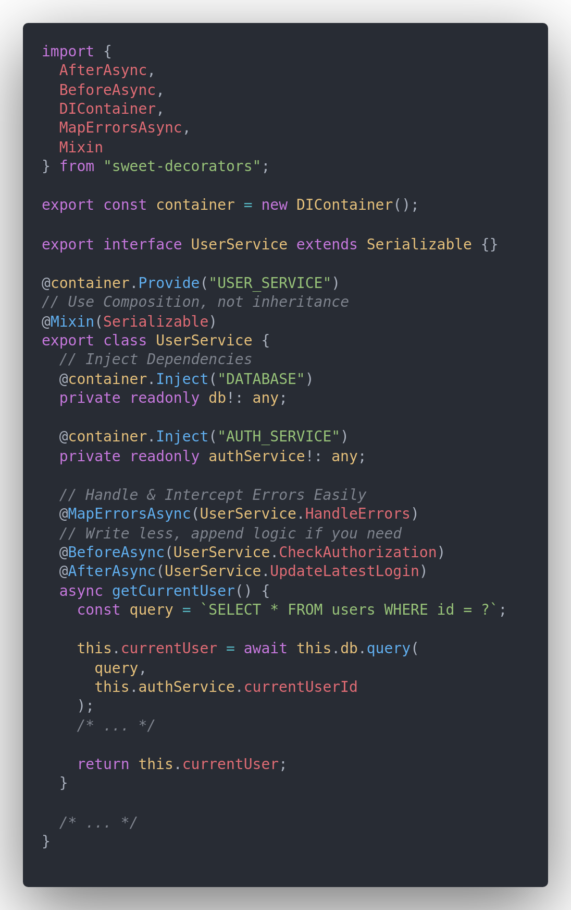

# 🍬 Sweet Decorators Lib

[](https://github.com/AlexXanderGrib/sweet-decorators/blob/master/LICENSE)
[](https://npmjs.com/package/sweet-decorators)
[](https://github.com/AlexXanderGrib/sweet-decorators)
[](#)

**Zero dependency** collection of common used **typescript** & javascript **patterns** provided in convenient format of **decorators**.

### Fast Q&A

| Question                | Answer                                                                                                           |
| ----------------------- | ---------------------------------------------------------------------------------------------------------------- |
| Why use this lib?       | To make your code more clean & concise                                                                           |
| Is it **treeshakable**? | Yes, but [`Hooks`](#method-hooks-before-after-around-beforeasync-afterasync-aroundasync) will be included anyway |
| Where are the docs?     | Here, in README, continue reading                                                                                |
| Is it production-ready? | Maybe. All features are simple as a stick & everything described                                                 |

## Before You Begin

**⚠️ Please, consider to read [Microsoft's article about Decorators Composition](https://www.typescriptlang.org/docs/handbook/decorators.html#decorator-composition) ⚠️**

### 📦 Installation (`npm`)

```bash
npm i --save sweet-decorators
```

### 📦 Installation (`yarn`)

```bash
yarn add sweet-decorators
```

### 📕 Table of contents

- [🍬 Sweet Decorators Lib](#-sweet-decorators-lib)
    - [Fast Q&A](#fast-qa)
  - [Before You Begin](#before-you-begin)
    - [📦 Installation (`npm`)](#-installation-npm)
    - [📦 Installation (`yarn`)](#-installation-yarn)
    - [📕 Table of contents](#-table-of-contents)
  - [👀 Demo](#-demo)
  - [`@Mixin`](#mixin)
  - [Meta assignment via `@Assign` and `@Assign.<Key>`](#meta-assignment-via-assign-and-assignkey)
      - [Meta assignment and reading tips and best practices](#meta-assignment-and-reading-tips-and-best-practices)
  - [`@MapErrors` and `@MapErrorsAsync`](#maperrors-and-maperrorsasync)
      - [`@MapErrors` tips and best practices](#maperrors-tips-and-best-practices)
  - [Dependency injection via `DIContainer`](#dependency-injection-via-dicontainer)
      - [Example of injection of simple value](#example-of-injection-of-simple-value)
      - [Example of providing a class](#example-of-providing-a-class)
      - [Example of usage `injectAsync` method](#example-of-usage-injectasync-method)
      - [Tips & best practices of DI](#tips--best-practices-of-di)
  - [Method hooks: `@Before`, `@After`, `@Around`, `@BeforeAsync`, `@AfterAsync`, `@AroundAsync`](#method-hooks-before-after-around-beforeasync-afterasync-aroundasync)
      - [Simple Hooks Example](#simple-hooks-example)
      - [User Service Example](#user-service-example)
      - [Hooks best practices & capabilities](#hooks-best-practices--capabilities)
  - [Memoization of methods via `@Memoize` & `@MemoizeAsync`](#memoization-of-methods-via-memoize--memoizeasync)
      - [Memo's Limitations](#memos-limitations)
      - [Example of using @Memoize with Dates](#example-of-using-memoize-with-dates)
      - [Memo Tips & Best Practices](#memo-tips--best-practices)

## 👀 Demo



## `@Mixin`

Mixin is a pattern of `assigning new methods` and static properties to an existing class. It's called `composition`.
This decorator just makes it easy, by using by abstracting `applyMixin` function described in [typescript docs](https://www.typescriptlang.org/docs/handbook/mixins.html)

**Example**

```typescript
import { Mixin } from "sweet-decorators";

class Swimmable {
  swim() {
    console.log("🏊‍♂️");
  }
}

class Walkable {
  walk() {
    console.log("🚶‍♂️");
  }
}

class Flyable {
  fly() {
    console.log("🐦");
  }
}

@Mixin(Swimmable, Walkable)
class Human {}
interface Human extends Swimmable, Walkable {}

@Mixin(Walkable, Flyable)
class Bird {}
interface Bird extends Walkable, Flyable {}

const human = new Human();
human.swim();
// => 🏊‍♂️

const bird = new Bird();
bird.fly();
// => 🐦
```

## Meta assignment via `@Assign` and `@Assign.<Key>`

This decorator is used in pair with `readMeta` method. Here is the example:

```typescript
import { Assign, readMeta } from "sweet-decorators";

// You can use multiple syntaxes of the decorator
@Assign({ BASE_BEHAVIOR: "passive" }) // If u pass object, his props will be merged with current meta
@Assign("isTest", process.env.NODE_ENV === "test") // You can set prop directly
@Assign.ErrorClass(Error) // Or you can use @Assign.<key>(<value>) because its more beautiful alt to @Assign('<key>', <value>)
class Human {
  // All these decorators also applies to methods
  @Assign({ IS_ACTION: true })
  @Assign.ActionType("MOVEMENT")
  @Assign(Symbol("ENTITY_TOKEN"), "X_HUMAN_ENTITY")
  @Assign({ IS_ACTION: false }) // will be overridden
  walk() {}
}

const human = new Human();

console.log(readMeta(human));
// => { BASE_BEHAVIOR: "passive", isTest: false, ErrorClass: Error }

console.log(readMeta(human.walk));
// => { IS_ACTION: true, ActionType: "MOVEMENT", Symbol(ENTITY_TOKEN): "X_HUMAN_ENTITY" }
```

#### Meta assignment and reading tips and best practices

1. Meta is accessible in other(upper) decorators
2. If you need to set **more than 2** meta props, please use **object syntax**
3. Use meta as simple **key/value dto storage**. Do not try to put here functions

## `@MapErrors` and `@MapErrorsAsync`

This decorator in used to `intercept errors` to catch and display more effectively one layer up

```typescript
import { MapErrorsAsync } from "sweet-decorators";
import { FetchError } from "node-fetch";
import { PaymentError } from "../errors";

const fetchErrorMapper = (error: Error) => {
  if (error instanceof FetchError) {
    return new PaymentError(
      "Cannot connect to remote endpoint",
      PaymentError.Code.NetworkError
    );
  }

  return;
};

const refErrorMapper = (error: Error) => {
  if (error instanceof ReferenceError) {
    return new PaymentError(
      "Internal reference error",
      PaymentError.Code.InternalError
    );
  }

  return;
};

class PaymentSystem {
  // You can use multiple mappers for handle different types of errors separately
  @MapErrorsAsync(fetchErrorMapper, refErrorMapper)
  async finishPayment(id: string) {
    /* ... */
  }
}

// In some other file
const ps = new PaymentSystem();

app.post("/finish-3ds", async (req, res) => {
  try {
    const response = await ps.finishPayment(req.query.id);

    /* ... */
  } catch (error) {
    console.log(error);
    // => PaymentError(NETWORK_ERROR): Cannot connect to remote endpoint
  }
});
```

#### `@MapErrors` tips and best practices

1. Mapper must return error (at least something nested from `Error` class)
2. Mapper must return `undefined`, to pass control to next mapper
3. Mapper must not throw an error
4. Mapper must not have slow side effects (be perfect if the only side effect is sync & atomic logging)

## Dependency injection via `DIContainer`

This is simple implementation of **`dependency injection`** pattern in typescript **`without assigning any metadata`**.

#### Example of injection of simple value

```typescript
import { DIContainer } from "sweet-decorators";

const container = new DIContainer();
const SECRET_TOKEN = Symbol("SECRET_TOKEN");

container.provide(SECRET_TOKEN, process.env.SECRET_TOKEN);

class ExternalAPIClient {
  @container.Inject(SECRET_TOKEN)
  private readonly token!: string;

  public call(method: string, params: object) {
    params = { token: this.token, ...params };

    /* foreign api call logic */
  }

  public get secretToken() {
    return this.token;
  }
}

const client = new ExternalAPIClient();

console.log(client.secretToken === process.env.SECRET_TOKEN);
// => true
```

#### Example of providing a class

```typescript
import { DIContainer } from "sweet-decorators";

const container = new DIContainer();

// You must give a name(token) to provided class
@container.Provide('CONFIG_SERVICE');
class ConfigService {
  // BAD BAD BAD. Constructor of a provider can't have params. Because his initialization is controlled by container
  constructor(public path: sting) {}

  get(propertyPath: string): any { /* ... */ }
}


class Database {
  @container.Inject('CONFIG_SERVICE')
  private readonly config: ConfigService;

  public connection = this.config.get('db.connectionString')

  /* ... logic ... */
}
```

#### Example of usage `injectAsync` method

```typescript
import { DIContainer } from "sweet-decorators";

const container = new DIContainer();

setTimeout(
  () =>
    container.provide(
      "DB_SERVICE",
      new DB({
        /* ... */
      })
    ),
  5000
);

async function main() {
  const start = Date.now();

  const db = await container.injectAsync("DB_SERVICE");

  const time = Date.now() - start;

  console.log(time);

  /* logic */
}

main();
// => 5005
```

#### Tips & best practices of DI

Common tips applicable to any realization of DI in TS.

1. Provide `classes`, inject `interfaces`
2. Do not be afraid of using `Symbols` as keys
3. Make sure to have at least runtime check of dependency (ex. dep is not `undefined`)

Tips for using my realization of DI.

1. If you're injecting dependency as property, please add `!`, to indicate TS that property will not be initialized in constructor
2. Check property dependencies in runtime, because they provided `asynchronously by getter`
3. If you want to get dependencies reliably, you can use `injectAsync` method
4. If dependency, that `injectAsync` method is waiting for, is not provided, it will hang execution of your code

## Method hooks: `@Before`, `@After`, `@Around`, `@BeforeAsync`, `@AfterAsync`, `@AroundAsync`

This decorators used to call methods around other methods. Its can help make
code more concise by moving similar aspects out of the method.

#### Simple Hooks Example

```typescript
import { Before, After, Around } from "sweet-decorators";

function before(...args: any[]) {
  console.log("Before", { args });
}

function after(result: any[], ...args: any[]) {
  console.log("After", { result, args });
}

function around(fn: Function, ...args: any[]) {
  console.log("Before (Around)");

  fn(...args);

  console.log("After (Around)");

  return 43;
}

class Test {
  // Order of decorators matters
  @Before(before)
  @After(after)
  @Around(around)
  example(..._args: any[]) {
    console.log("Call Example");

    return 42;
  }
}

const result = new Test().example(1488);

console.log(result === 42);

/*
Before { args: [ 1488 ] }
Before (Around)
Call Example
After (Around)
After { result: 43, args: [ 1488 ] } // If you swap `@After` and `@Around` in function declaration, result will be 42
false 
// False, because function `around` changed it
*/
```

#### User Service Example

```typescript
import { AroundAsync, AfterAsync, BeforeAsync } from "sweet-decorators";

function checkAuthorization(this: UserService) {
  if (!this.currentSession) {
    throw new UserError("Unauthorized");
  }
}

async function updateLastLogin(this: UserService, result: any, ...args: any[]) {
  if (result.success) {
    await this.db.query(/* ... */);
  }
}

async function handleErrors(this: UserService, fn: Function, ...args: any[]) {
  try {
    return await fn(...args);
  } catch (error) {
    if (error instanceof DBError) {
      throw new UserError("Database got wrong");
    }

    throw error;
  }
}

class UserService {
  @AroundAsync(handleErrors) // First decorator wraps all next
  // If you put it ^ last. It will wrap only the function content.
  // That's how decorators work
  // https://www.typescriptlang.org/docs/handbook/decorators.html#decorator-composition
  @AfterAsync(updateLastLogin)
  @BeforeAsync(checkAuthorization)
  async getPersonalData() {
    /* ... */
  }

  /* ... */
}
```

#### Hooks best practices & capabilities

Section may contain Cap's notices.

1. Put your **validation** to `@Before`
2. Put your **metrics** to `@Around`
3. Put your **side effects** to `@After`
4. Put **error handling** to `@Around`, except your project is good at using `either monad`
5. Mix more than 2 of these decorators together **only** if you strongly know order of execution. If not, read the [warning](#before-you-begin) and linked article

## Memoization of methods via `@Memoize` & `@MemoizeAsync`

This decorator is used to easily create memoized functions.

#### Memo's Limitations

**By default, memo storage uses storage, that caches method's result only by `1st parameter`**. If you want to change this behavior you can create your own storage by implementing `IMemoStorage` interface.

#### Example of using @Memoize with Dates

```typescript
import { Memoize } from "sweet-decorators";
import { promisify } from "util";

const sleep = promisify(setTimeout);

class Example {
  @Memoize()
  date() {
    return new Date().toString();
  }
}

const e = new Example();

async function main() {
  const now = e.date();

  await sleep(10);

  console.log(
    e.date() === now, // 10 ms passed, but result remembered
    now === new Date().toString()
  );
}

main();
// => true, false
```

#### Memo Tips & Best Practices

1. You can bundle your fp methods to class, decorate, and then get methods back by using spreading.
2. If you have troubles with returning cached result where is not supposed to do so, try reading [limitations](#memos-limitations) and writing your own memo store.
3. `@Memoize` & `@MemoizeAsync` uses hooks `@Around` & `@Around` async under the hood. Please consider this while bundling your code.
